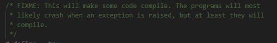
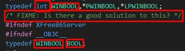
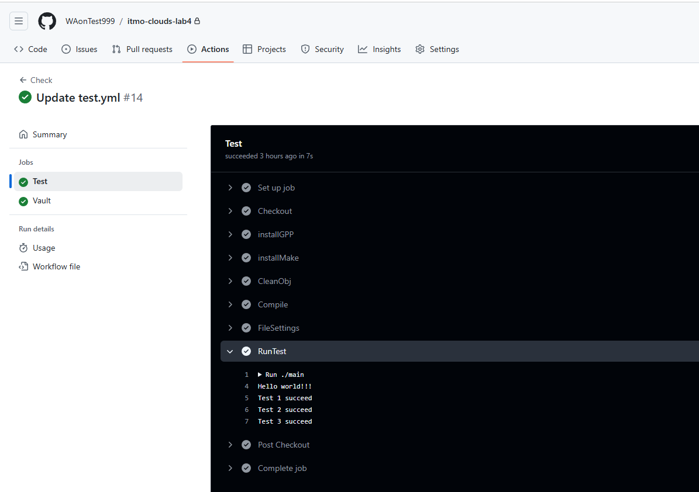
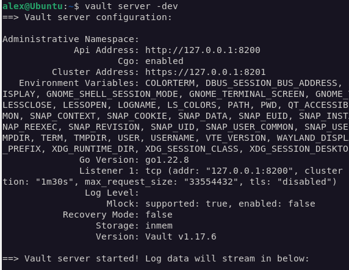
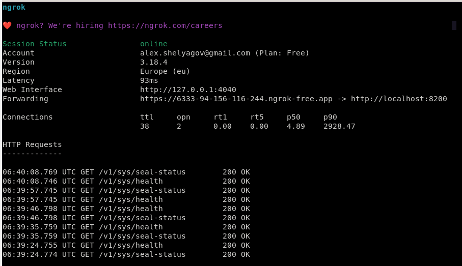
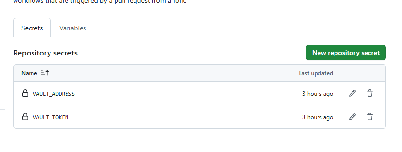
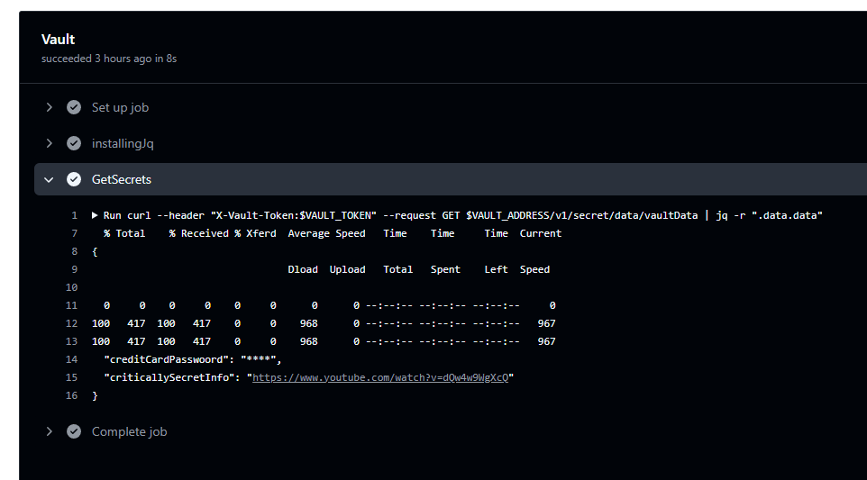

# Задание для Лабораторной 4
- Написать “плохой” CI/CD файл, который работает, но в нем есть не менее пяти “bad practices” по написанию CI/CD.
- Написать “хороший” CI/CD, в котором эти плохие практики исправлены.
- В Readme описать каждую из плохих практик в плохом файле, почему она плохая и как в хорошем она была исправлена, как исправление повлияло на результат.

# Выполнение
## Подготовка проекта

Сначала, я создал небольшой проект из двух .cpp файлов(функция + ее тест), которые в финале дожны с помощью CI/CD make'ом собираться в исполняемый файл. В результате получилась такая структура:
```
    .
    ├── obj
    ├── src
    │   ├── main.cpp
    │   ├── test.cpp
    │   └── test.h
    └── makefile
```
## Выбор и настройка CI/CD
Вот и настало время выбирать сервис для CI/CD немного подсмотрев через что делали остальные, я увидел следующую фразу(или сам надумал ее себе в голове(шиз)): **Будем использовать GitLab CI/CD(💩) вместо GitHub Actions(🗿), так как GitHub Actions требут верификацию с зарубежного номера**. 
Так меня давно не обманывали.... 

И вот, я, нехотя, зарегистрировался в GitLab'е и создал репозиторий, пробираясь через тысячи всплывающих окон с "невероятно юзер френдли" интерфейсом. Затем, я пытался подвязать GitLab к VSCode'у, но, сделав что-то не идеально с первого раза, я попал в ловушку бесконечных ерроров без логов, которые никак не исправлялись.
Через 2-3 часа, нагадив в настройках Extention'а и аккаунте GitLaba так, что спасало бы только удаление аккаунта + переустановка VSCoda, я сдался."Сделаю все красиво, удобно и правильно" проиграло "Просто напихаю каждый файл через отдельный коммит🤡". Вот, наконец, собрав проект я открыл настройку CI/CD и...

...и умер.


Но, чувство ответственности пред командой отложило мою смерть до лучших времен и я вернулся на родоной Github. Здесь, за 5 минут все успешно закоммитилось и запушилось, и, без каких-либо проблем, я приступил к написанию .yml файла, который в итоговом виде выглядит вот так:

```
name: Check
on:b push

jobs:
    Test:
        runs-on: ubuntu-latest
        steps:
            - name: First
              uses: actions/checkout@v4.2.2
            - name: Second
              run: echo 'installing env utills'
              run: sudo apt install g++
              run: sudo apt install make
            - name: Third
              run: echo 'Cleans .obj files'
              run: make clean
            - name: Last
              run: echo 'Compiles project'
              run: make all
              run: chmod +x ./main
              run: ./main
    Vault:
        runs-on: ubuntu-latest
        steps:
            - name: Inst
              run: sudo apt install jq
            - name: Get
              env:
                  VAULT_ADDRESS: ${{ secrets.VAULT_ADDRESS }} 
                  VAULT_TOKEN: ${{ secrets.VAULT_TOKEN }} 
              run: curl --header "X-Vault-Token:hvs.RbrvDUd9XEOgya1WiZFXlt6o" --request GET https://6333-94-156-116-244.ngrok-free.app/v1/secret/data/vaultData | jq -r ".data.data"
              
```

Плох он следующим:

### Множественная ответственность
Каждый таск должен отвечать за одно действие, не должно быть мултизадачных тасков. Это необходимо, так как в логах четко видно какие этапы пройдены успешно, а какие нет.

Вообще, хотел адаптировать принципы, обратные SOLID принципам сюда, но уже на втором понял, что это не очень получается(

### Несоблюдение "кодстайла"
Все составляющие названы должэны быть названы адекватными именами. Должна быть схожая форма названий тасков.

### Отстуствие явного указания версий
К сожалению, обратная совместимость есть далеко не у всех проектов, так что надеятся, что все latest-релизы всегда соберуться успешно, не стоит.

### Избыточное комментирование
Комментировать обычно принято сложные/автроские реализации. Нет смысла писать комментарий, который почти полностью дублирует говорящее название таска.

### Запуск по любому push'у
В проекте каждый запуск actiona должен относится только к изменением связанных с ним файлов, он не должен запускаться при пуше в сторонние ветки или, при пуше картинок/документации и т.д..

### Отсутствие сокрытия данных
Последняя проблема как раз подводит к заданию со звездочкой. Без сокрытия данных, их иногда можно найти в коде или логах, это надо исправлять.

Ну, и хороший(исправленный) yaml-файл:


```
name: Check
on:
  push:
    branches:
      - main

jobs:
    Test:
        runs-on: ubuntu-latest
        steps:
            - name: Checkout
              uses: actions/checkout@v4.2.2
            - name: InstallGPP
              run: sudo apt install g++=6.3.0
            - name: InstallMake
              run: sudo apt install make=3.81
            - name: CleanObj
              run: make clean
            - name: Compile
              run: make all
            - name: FileSettings
              run: chmod +x ./main
            - name: RunTest
              run: ./main
    Vault:
        runs-on: ubuntu-latest
        steps:
            - name: InstallingJq
              run: sudo apt install jq=1.6
            - name: GetSecrets
              env:
                  VAULT_ADDRESS: ${{ secrets.VAULT_ADDRESS }} 
                  VAULT_TOKEN: ${{ secrets.VAULT_TOKEN }} 
              run: curl --header "X-Vault-Token:$VAULT_TOKEN" --request GET $VAULT_ADDRESS/v1/secret/data/vaultData | jq -r ".data.data"
              
```


## Критическая ошибка №2
Но, перед тем как прийти к показанному ранее "хорошему" результату, произошла маленькая проблема, которая убила еще часа 2 - таск с тестированием не работал. Я же, как истинный average C++ enjoyer, решил не развернуть проект в одну строчку на питоне, а собирать C++ проект через make. Все дело в том, что make, который собирает зависимости заново только если в них есть изменения, 
каким-то образом начинал видеть несуществующие(как думал я) файлы. Оказалось, что я не сделал gitignore, который будет пропускать объектные файлы и залил в GitHub проект со скомпилированными под windows файлами и пытался линковать их на Ubuntu(🤡🤡🤡).
Зато, в процессе поиска решения, я случайно залез в системные библиотекия плюсов и обнаружил там такую интересную вещь, как FIXME-заметки в количестве 1 штука на 20-40 строк кода. А это проект с 40-летней историей и многомиллионным комьюнити.







И вот, наконец-то все заработало:



# Задание для Лабораторной 4*
Сделать красиво работу с секретами. Например, поднять Hashicorp Vault и сделать так, чтобы ci/cd пайплайн (или любой другой ваш сервис) ходил туда, брал секрет, использовал его не светя в логах. В Readme аргументировать почему ваш способ красивый, а также описать, почему хранение секретов в CI/CD переменных репозитория не является хорошей практикой.


# Выполнение 4*
Эта часть уже лабораторной обощлась уже без проишествий. 
Сначала был поднять Vault и проброшен порт с помощью ngork:






Затем, были созданы две переменные в Vault:

1)Пароль от моей банковской карты - ****

2)Совершенно секретная [ссылка](https://www.youtube.com/watch?v=dQw4w9WgXcQ)


И две переменные в GitHub Secrets - для токена и для ссылки на Vault



Ну, и был написан последний task, в логах которого не было ни токена, ни ссылки:


```
    Vault:
        runs-on: ubuntu-latest
        steps:
            - name: InstallingJq
              run: sudo apt install jq=1.6
            - name: GetSecrets
              env:
                  VAULT_ADDRESS: ${{ secrets.VAULT_ADDRESS }} 
                  VAULT_TOKEN: ${{ secrets.VAULT_TOKEN }} 
              run: curl --header "X-Vault-Token:$VAULT_TOKEN" --request GET $VAULT_ADDRESS/v1/secret/data/vaultData | jq -r ".data.data"
```



P.S. В работе оказалось слишком много "но" и слишком мало сна, так что советую ее читать в соответствующем состоянии. 
